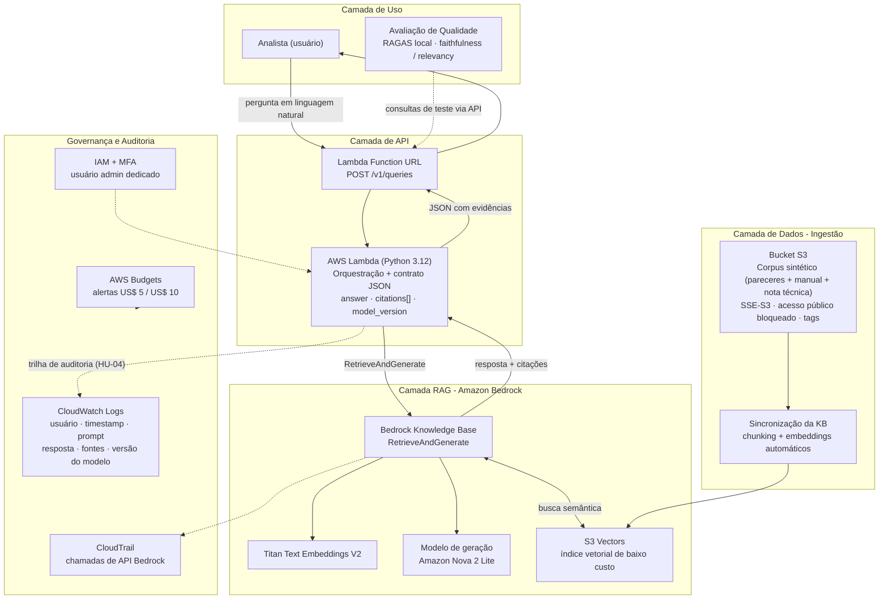

# Plataforma GenAI de Análise Documental em AWS — Estudo de Caso de Engenharia de Requisitos

> **EN summary:** Requirements Engineering case study with a reference implementation on AWS: a RAG-based document analysis API for regulated environments, fully traceable from user stories and NFRs to working code, audit trail, and LLM quality evaluation (RAGAS). Built by a Senior Business Analyst / Requirements Engineer with 10 years in regulated institutional projects (ANVISA, Petrobras, SEFAZ-PB).

Estudo de caso demonstrativo com implementação de referência. O objetivo é mostrar rastreabilidade completa: **requisito especificado → arquitetura → implementação → evidência → avaliação de qualidade**.

**Status do projeto:** em andamento. Fases 0 a 3 concluídas (infraestrutura, dados, RAG funcional, API em produção). Próximas: auditoria estruturada, avaliação RAGAS.

**Autor:** Nil Alisson A. Pereira — Analista de Requisitos / Engenheiro de Requisitos Sênior
[LinkedIn](https://linkedin.com/in/nilalisson) · [Site](https://nilalisson.com.br) · nilalisson@gmail.com

---

## 1. O problema

Órgãos reguladores processam grandes volumes de documentos técnicos (petições, laudos, pareceres) com análise manual demorada e sujeita a inconsistência entre versões de um mesmo processo — por exemplo, quando um parecer é retificado e a versão desatualizada continua circulando. Este estudo de caso especifica os requisitos de uma plataforma de apoio à análise documental com GenAI (arquitetura RAG), hospedada em AWS, que responde perguntas sobre o corpus documental citando a fonte exata de cada afirmação.

**Regra de negócio central:** a IA sugere e evidencia; o analista decide. Nenhuma decisão regulatória é automatizada.

Ver especificação completa em [`docs/caso_de_uso_projeto3.md`](docs/caso_de_uso_projeto3.md).

## 2. Arquitetura



Diagrama fonte em [`diagrams/arquitetura_case_aws.mermaid`](diagrams/arquitetura_case_aws.mermaid).

Decisões de arquitetura orientadas por requisitos não funcionais:

| RNF | Especificação | Decisão AWS |
|---|---|---|
| Residência de dados | Dados em repouso e em processamento em região com catálogo Bedrock completo | us-east-1, por limitação real de disponibilidade de modelos em sa-east-1 (achado de discovery, ver nota abaixo) |
| Segurança | Criptografia em repouso; segregação por perfil de acesso | S3 SSE-S3, bloqueio de acesso público, IAM com MFA |
| Custo | Estimativa e monitoramento por componente desde o discovery | AWS Budgets (US$ 5 / US$ 10), tagging por módulo (`projeto`, `modulo`), S3 Vectors em vez de OpenSearch Serverless |
| Auditabilidade | Logs imutáveis de todas as interações | CloudTrail (nativo para chamadas Bedrock) + CloudWatch Logs (pendente na Lambda, Fase 4) |
| Qualidade da IA | Avaliação contínua de fidelidade e relevância das respostas | Pipeline de avaliação com RAGAS (pendente, Fase 5) |

> **Achado de discovery:** a disponibilidade limitada de modelos Bedrock em sa-east-1 validou o RNF de residência de dados como restrição real de projeto, não apenas teórica. Esta implementação de referência usa us-east-1 com dados sintéticos (sem dado real de nenhum titular), documentando a restrição para um cenário de produção no Brasil.

> **Decisão sobre o corpus:** os documentos usados são sintéticos, gerados especificamente para este case (ver Seção 8). Isso permitiu desenhar cenários de teste com gabarito conhecido — incluindo uma divergência proposital entre duas versões de um mesmo parecer técnico, usada para validar se o sistema recupera a versão correta de um documento retificado.

## 3. Requisitos (amostra)

**HU-01 — Ingestão de documentos.** Como analista, quero enviar documentos para a plataforma, para que sejam indexados e disponíveis para consulta semântica.

**HU-02 — Consulta semântica com evidência.** Como analista, quero perguntar em linguagem natural sobre o conteúdo dos documentos, para localizar informações sem leitura integral. Toda resposta deve citar documento, página e trecho de origem. ✅ **Validado** — ver Seção 5.

**HU-03 — Verificação de consistência entre documentos.** Como analista, quero comparar declarações entre documentos de um mesmo processo, para identificar divergências antes do parecer. ✅ **Validado parcialmente** via consulta que cruza parecer retificado e nota técnica — ver Seção 5.

**HU-04 — Trilha de auditoria.** Como gestor de conformidade, quero registro imutável de todas as interações com a IA. ⬜ Pendente (Fase 4).

Especificação completa com critérios BDD em [`docs/caso_de_uso_projeto3.md`](docs/caso_de_uso_projeto3.md).

## 4. Contrato de API vs. implementação

**Especificado no discovery:**

```json
{
  "endpoint": "POST /v1/queries",
  "request": {
    "question": "string",
    "process_scope": "string (opcional)"
  },
  "response": {
    "answer": "string",
    "citations": [
      {"document": "string", "page": "number", "excerpt": "string"}
    ],
    "confidence": "number"
  }
}
```

**Resposta real da API implementada** (Lambda + Function URL, testada via curl):

```json
{
  "answer": "The validity period of the Environmental Monitoring Device Model DX-7's registration has been adjusted to 18 months, counting from the date of issuance of the original opinion (14/02/2026)...",
  "citations": [
    {
      "document": "s3://nil-case-genai-docs/ANVF-PT-2026-001-R1_Parecer_Revisao.pdf",
      "excerpt": "O requerente apresentou novos dados de estabilidade que resultam em ajuste do prazo de validade originalmente concedido. [...] o prazo de validade de registro é retificado de 24 meses para 18 (dezoito) meses..."
    },
    {
      "document": "s3://nil-case-genai-docs/ANVF-PT-2026-001-R1_Parecer_Revisao.pdf",
      "excerpt": "Agência Nacional de Vigilância Fictícia — ANVF [...] ANVF-PT-2026-001-R1 | Revisão 1 | 30/05/2026..."
    },
    {
      "document": "s3://nil-case-genai-docs/ANVF-NT-2026-010_Nota_Tecnica.pdf",
      "excerpt": "O prazo retificado prevalece sobre o prazo original a partir da data de emissão da revisão [...] exemplifica a aplicação correta deste procedimento."
    },
    {
      "document": "s3://nil-case-genai-docs/ANVF-PT-2026-001_Parecer_Original.pdf",
      "excerpt": "Os ensaios apresentados pelo requerente atendem aos parâmetros de referência para produtos da Classe II. [...] prazo de validade de registro de 24 (vinte e quatro) meses..."
    }
  ],
  "citations_count": 4,
  "model_version": "arn:aws:bedrock:us-east-1:539562792209:inference-profile/us.amazon.nova-2-lite-v1:0"
}
```

Diferenças conscientes entre o especificado e o implementado: `page` foi substituído por URI completo do S3 (mais rastreável que número de página para documentos gerados dinamicamente); `confidence` foi substituído por `citations_count`, que se mostrou uma métrica mais direta de checar na prática. Ambas as mudanças estão documentadas aqui em vez de silenciosamente divergentes — rastreabilidade entre especificação e implementação inclui documentar onde e por que elas diferem.

Código da Lambda em [`lambda/lambda_function.py`](lambda/lambda_function.py).

## 5. Validação funcional (via console Bedrock)

Antes de expor a API (Fase 3), a Knowledge Base foi testada diretamente no console para validar a qualidade da recuperação. Três perguntas, cada uma alvo de uma HU:

| Pergunta | Resposta obtida | HU validada | Evidência |
|---|---|---|---|
| Qual o prazo de validade do Dispositivo DX-7? | **18 meses** (versão retificada, não os 24 meses do parecer original) | HU-02 | [`evidence/fase2_pergunta1_resposta_18meses.png`](evidence/fase2_pergunta1_resposta_18meses.png), citação: [`evidence/fase2_pergunta1_citacao_source_chunk.png`](evidence/fase2_pergunta1_citacao_source_chunk.png) |
| Existe alguma retificação de prazo registrada? | Identificou a nota técnica e explicou a mudança de 24 para 18 meses | HU-03 | [`evidence/fase2_pergunta2_retificacao.png`](evidence/fase2_pergunta2_retificacao.png) |
| Qual o prazo padrão para produtos Classe III? | 12 meses, citando o manual e cruzando com um parecer real de produto Classe III | HU-02 / HU-03 | [`evidence/fase2_pergunta3_classe3.png`](evidence/fase2_pergunta3_classe3.png) |

**Por que a primeira pergunta importa mais que parece:** o corpus foi desenhado de propósito com um parecer original (24 meses) e uma revisão posterior (18 meses). Um RAG que apenas busca por similaridade textual, sem considerar qual documento é mais recente ou qual foi retificado, poderia responder 24 meses e estaria tecnicamente "certo" sobre o que um documento diz — mas errado sobre qual é a validade vigente. O sistema recuperou a versão correta.

**Achado registrado para a Fase 5:** perguntas com o nome do produto tiveram score de relevância mais alto (0,76) que perguntas genéricas sobre o tema (0,44-0,45), mesmo quando ambas retornaram resposta correta. Ainda não avaliado se isso é ruído do corpus pequeno (6 documentos) ou um padrão que se sustenta em escala — é um dos objetivos da avaliação RAGAS.

## 6. Trilha de auditoria (HU-04)

⬜ Pendente. Será implementada na Fase 4, registrando em CloudWatch Logs: usuário, timestamp, prompt, resposta, fontes citadas e versão do modelo.

## 7. Avaliação de qualidade (RAGAS)

⬜ Pendente (Fase 5). Conjunto de perguntas com gabarito conhecido (o corpus sintético foi desenhado para isso) será avaliado quanto a faithfulness e answer relevancy.

## 8. Evidências

- [`evidence/fase1_bucket_tags_criptografia.png`](evidence/fase1_bucket_tags_criptografia.png) — bucket S3 com criptografia e tags de custo
- [`evidence/fase1_upload_corpus_sucesso.png`](evidence/fase1_upload_corpus_sucesso.png) — upload dos 6 documentos sintéticos, 0 falhas
- [`evidence/fase2_knowledge_base_criada.png`](evidence/fase2_knowledge_base_criada.png) — Knowledge Base criada (Titan Embeddings V2 + S3 Vectors)
- [`evidence/fase2_sync_completo.png`](evidence/fase2_sync_completo.png) — sincronização da base de dados concluída
- [`evidence/fase2_pergunta1_resposta_18meses.png`](evidence/fase2_pergunta1_resposta_18meses.png) e [`evidence/fase2_pergunta1_citacao_source_chunk.png`](evidence/fase2_pergunta1_citacao_source_chunk.png) — validação principal (ver Seção 5)
- [`evidence/fase2_pergunta2_retificacao.png`](evidence/fase2_pergunta2_retificacao.png), [`evidence/fase2_pergunta3_classe3.png`](evidence/fase2_pergunta3_classe3.png) — validações complementares

## 9. Estrutura do repositório

```
/docs        especificação completa do caso de uso (HUs, RNFs, riscos)
/corpus      corpus sintético de 6 PDFs usado na Knowledge Base
/diagrams    diagrama de arquitetura (Mermaid)
/evidence    prints das evidências de cada fase
/roadmap     passo a passo detalhado de execução do projeto (todas as fases)
/linkedin    rascunhos dos posts de acompanhamento do projeto
/lambda      código da função Lambda (pendente, Fase 3)
/evaluation  scripts e resultados RAGAS (pendente, Fase 5)
```

## 10. Sobre o corpus sintético

Os 6 documentos usados (`ANVF-MP-001` a `ANVF-NT-2026-010`) representam uma agência reguladora fictícia (ANVF), criada especificamente para este estudo de caso. Cada documento traz um aviso de que é sintético. A escolha por documentos fictícios em vez de documentos reais de órgãos regulados permitiu desenhar cenários de teste com gabarito conhecido, incluindo a divergência proposital usada para validar a HU-03. Ver os PDFs em [`corpus/`](corpus/).

## 11. Reprodutibilidade

O passo a passo completo de execução, incluindo decisões técnicas e problemas encontrados durante a implementação (ex.: nome inválido de data source na primeira tentativa), está documentado em [`roadmap/passo_a_passo.md`](roadmap/passo_a_passo.md). A infraestrutura será desprovisionada ao final do projeto (Fase 7); o ambiente é reproduzível seguindo o roadmap.

## 12. Evolução mapeada

Este case é construído como uma trilha de evolução deliberada, não um projeto fechado. As próximas etapas foram escolhidas observando o que o mercado de AI Engineer remoto (Brasil e internacional) tem pedido com mais frequência em 2026:

- **Interface conversacional com histórico de sessão** (suportado nativamente pela API RetrieveAndGenerate)
- **Exposição via protocolo MCP** (Model Context Protocol) — agentes que conectam serviços via Python, tema recorrente em vagas de AI Engineer que envolvem integração entre múltiplos sistemas
- **Orquestração multi-agente** (frameworks como LangChain/LangGraph ou crewAI) como camada acima do RAG atual, para cenários que exigem mais de uma etapa de raciocínio ou mais de uma fonte de dados
- **Padronização de idioma de resposta** (o sistema espelhou o idioma da pergunta sem instrução explícita — observado durante os testes da Fase 2)
- **Segundo endpoint dedicado à verificação de consistência** (HU-03) como funcionalidade de primeira classe, não apenas resultado colateral de uma boa consulta
- **Estruturas de prompt e avaliação de modelo mais formalizadas** (prompt versionado, critérios de avaliação explícitos por caso de uso), aproximando o case de práticas de governança de IA generativa em ambiente corporativo

A lógica por trás dessa lista: cada item é ao mesmo tempo uma evolução técnica genuína do case e uma competência buscada de forma recorrente em vagas de transição BA/RE → AI Engineer.

## 13. Sobre o autor

Analista de Requisitos / Engenheiro de Requisitos com 10 anos de atuação em ambientes institucionais regulados (ANVISA, Petrobras, SEFAZ-PB, SEE-PB). Mestrando em Ciência da Computação (UFPB), com pesquisa aplicada em Engenharia de Requisitos assistida por LLMs. AWS Cloud Practitioner. Experiência prática em avaliação de qualidade de LLMs (SxS, fact-checking) via Turing.
